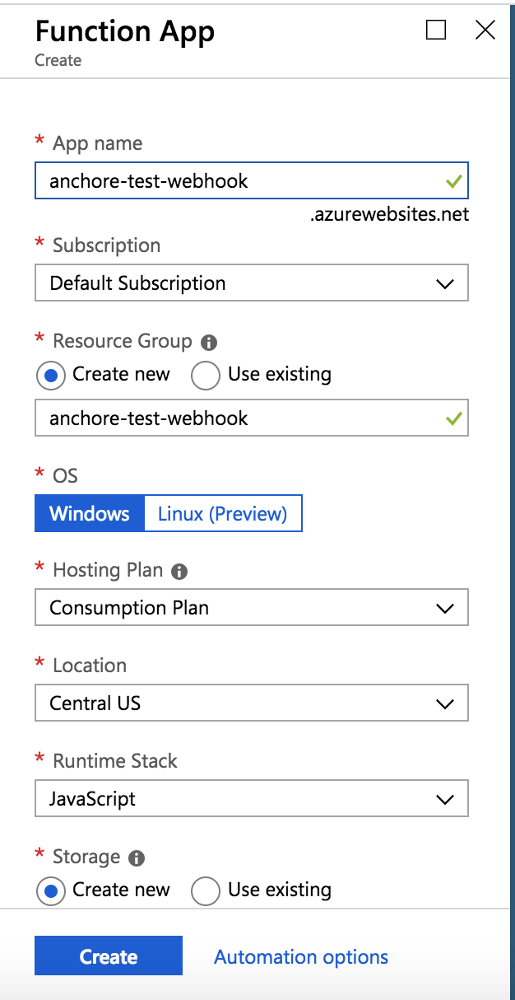
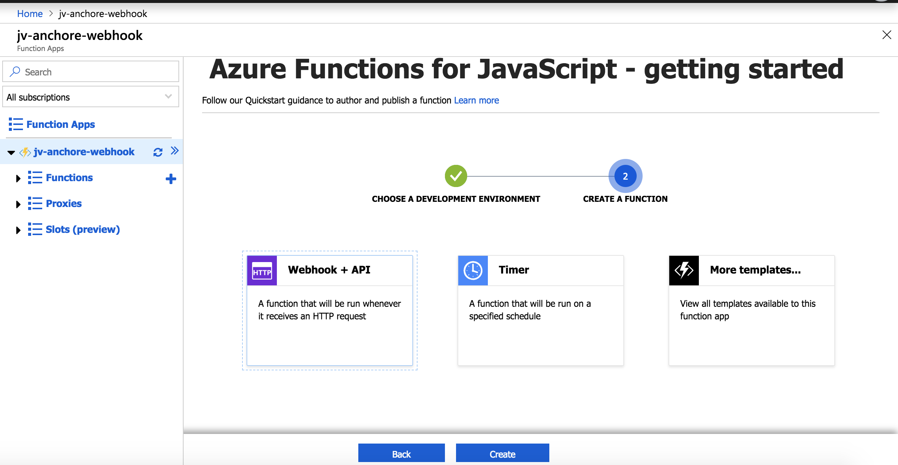
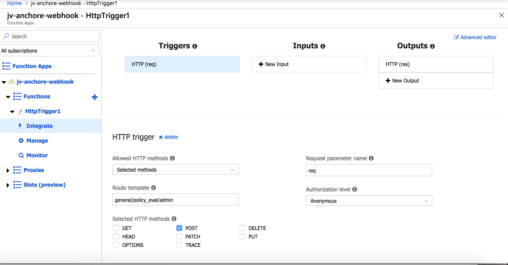

# Anchore Slack Notifications

## How to configure Slack webhooks to receive Anchore notifications via Azure Functions

In this example, we will walkthrough how to configure Slack webhooks to receive Anchore notifications. We will consume the webhook with an Azure Function and pass the notification data into a Slack channel.

You will need the following:

- Anchore Engine service: [Anchore](https:;//anchore.com)
- Slack account: [Slack](https://slack.com)
- Azure account: [Azure](https://azure.microsoft.com)

## Slack Configuration

Configure incoming webhooks to work with the Slack application you would like to send Anchore notifications to. The Slack documentation gives a very detailed walkthrough on how to set this up. 

https://api.slack.com/incoming-webhooks

## Azure Intial Configuration

Once you have an Azure account, begin by creating a Function App. In this example I will use the following configuration: 

Choose In-Portal development environment and then Webhook + API: 

Once the function has been setup, navigate to the integrate tab and edit the configuration: 

Finally, we will to select 'Get function URL' to retrieve the URL for the funtion we've just created. It should look similar to this format: https://jv-test-anchore-webhook.azurewebsites.net/api/general/policy_eval/admin

## Anchore Engine Configuration

If you have not setup Anchore Engine there are a couple choices:
- Navigate to our github repo: https://github.com/anchore/anchore-engine 
- Head to our support documentation: https://anchore.freshdesk.com/support/solutions/36000112471

Once you have a running Anchore Engine, we need to configure engine to send out webhook notifications to the URL of our Function App in Azure. Navigate here to learn how to edit the 'config,yaml' file for our Anchore Engine installation: https://anchore.freshdesk.com/support/solutions/articles/36000003890-working-with-subscriptions

Once the configuration is complete, you will need to activate a subscription, you can follow the documentation link above for more info on that. 

In this example, I have subscribed to a particular tag and am listening for 'policy_eval' changes. From the documentation: 

"This class of notification is triggered if a Tag to which a user has subscribed has a change in its policy evaluation status. The policy evaluation status of an image can be one of two states: Pass or Fail. If an image that was previously marked as Pass changes status to Fail or vice-versa then the policy update notification will be triggered."

## Azure Function Code

I kept this as minimal as possible in order to keep it open ended. In short, Anchore will be sending out the notification data to the webhook endpoint we've specified, we just need to write some code to consume it, and then send it to Slack. 

You can view the code here: https://raw.githubusercontent.com/valancej/Anchore-Slack-Notifications/master/index.js

Quick note: In the example, the alert to Slack is very basic. However, feel free to experiment with the notification data that Anchore sends to Azure and configure the POST data to Slack. 